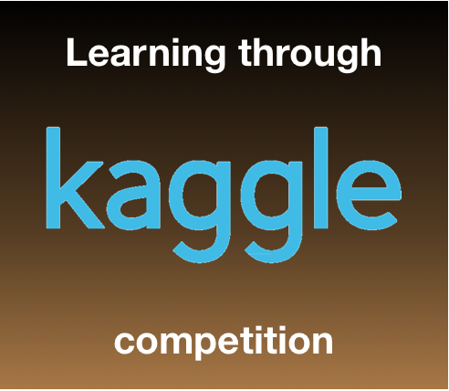

# Learning Through Kaggle Competition


## Project Idea

The aim of this project is to gain knowledge through Kaggle Competitions to become a Data Science. The idea is to solve and/or deeply analyze Kaggle competitions, where each action(code) has a clear explanation in orderto master the tools used.

We will learning basic fundamental skills such as 
- DataFrames in pandas, 
- Arrays, matrices, and mathematical functions in Numpy
- Plot figures in matplotlib, 
- Import and train models from scikit-learn.
- Basic Machine Learning models

Also, more advanced topics:

- Generate new features 
- Improve predictions by Nearest Neighbors, Aggregate data and Mean /Target Encoding.
- Tune hyperparameter
- Combine different Machine Learning Models

*I hope that this project help me and others to activate and accelerate the career in data science.*

```
Give examples
```

### Installing

A step by step series of examples that tell you how to get a development env running

Say what the step will be

```
Give the example
```

And repeat

```
until finished
```

End with an example of getting some data out of the system or using it for a little demo

## Running the tests

Explain how to run the automated tests for this system

### Break down into end to end tests

Explain what these tests test and why

```
Give an example
```

### And coding style tests

Explain what these tests test and why

```
Give an example
```

## Deployment

Add additional notes about how to deploy this on a live system

## Built With

* [Dropwizard](http://www.dropwizard.io/1.0.2/docs/) - The web framework used
* [Maven](https://maven.apache.org/) - Dependency Management
* [ROME](https://rometools.github.io/rome/) - Used to generate RSS Feeds

## Contributing

Please read [CONTRIBUTING.md](https://gist.github.com/PurpleBooth/b24679402957c63ec426) for details on our code of conduct, and the process for submitting pull requests to us.

## Versioning

We use [SemVer](http://semver.org/) for versioning. For the versions available, see the [tags on this repository](https://github.com/your/project/tags). 

## Authors

* **Billie Thompson** - *Initial work* - [PurpleBooth](https://github.com/PurpleBooth)

See also the list of [contributors](https://github.com/your/project/contributors) who participated in this project.

## License

This project is licensed under the MIT License - see the [LICENSE.md](LICENSE.md) file for details

## Acknowledgments

* Hat tip to anyone whose code was used
* Inspiration
* etc
